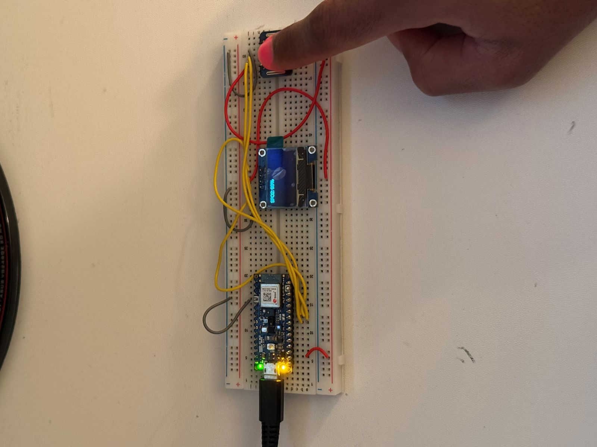
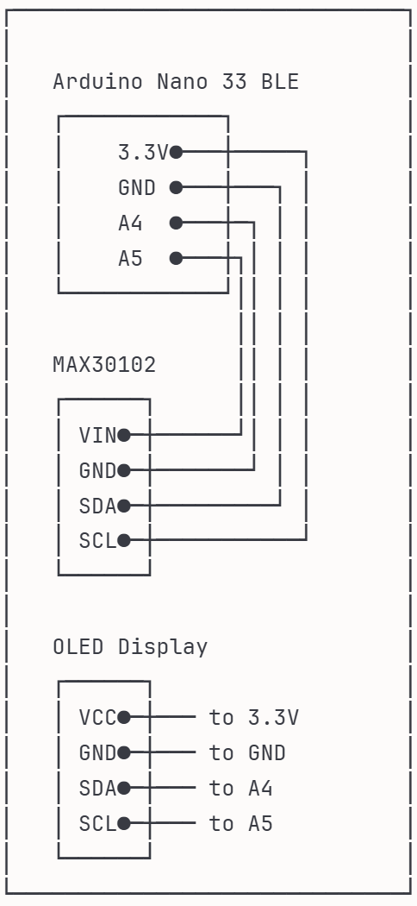

# Pulse Oximeter - MAX30102 SpO2 Monitor

A real-time blood oxygen saturation (SpO2) monitoring system using the MAX30102 sensor and Arduino Nano 33 BLE Sense Rev2.



## Overview

This project implements a functional pulse oximeter that measures blood oxygen saturation levels using photoplethysmography (PPG). The device displays real-time SpO2 readings on an OLED screen and has been optimized for robustness across different users and skin tones.

> **Educational Project Only:**  
> This is a learning prototype and is **not intended for medical diagnosis or clinical use**. Always use FDA-approved medical devices for health monitoring.

**Key Features:**
- Real-time SpO2 measurement (updates every 1 second)
- 128x64 OLED display with clear readings
- Signal validation to ensure accurate measurements
- Optimized LED brightness for universal usability
- Tested across different users and skin tones


## Project Motivation

As a freshman in Electrical and Computer Engineering at USC, I built this project to:
- Understand biomedical signal processing
- Learn embedded systems integration (I2C communication, sensor interfacing)
- Gain hands-on experience with real-world medical device technology
- Develop debugging and optimization skills

## Hardware Components

| Component | Model/Type | Purpose |
|-----------|------------|---------|
| Microcontroller | Arduino Nano 33 BLE Sense Rev2 | Main processor |
| SpO2 Sensor | MAX30102 | Pulse oximetry sensor (Red + IR LEDs) |
| Display | SSD1306 OLED 128x64 (I2C) | Real-time reading display |
| Breadboard | Standard 830-point | Prototyping |
| Jumper Wires | Male-to-male | Connections |
| USB Cable | Micro-USB | Power & programming |

**Total Cost:** ~$60-70

## Wiring Diagram
```
MAX30102 Sensor:
  VIN  → 3.3V
  GND  → GND
  SDA  → A4 (SDA)
  SCL  → A5 (SCL)

SSD1306 OLED Display:
  VCC  → 3.3V
  GND  → GND
  SDA  → A4 (SDA)
  SCL  → A5 (SCL)
```



## Software Implementation

### Libraries Used:
- `Wire.h` - I2C communication
- `MAX30105.h` - MAX30102 sensor driver
- `spo2_algorithm.h` - Maxim Integrated's SpO2 calculation algorithm
- `SSD1306Ascii.h` / `SSD1306AsciiWire.h` - OLED display driver

### Key Algorithm:
The device uses Maxim Integrated's proprietary algorithm for calculating SpO2 from photoplethysmography signals. The algorithm analyzes the ratio of AC/DC components in red and infrared light absorption to determine oxygen saturation.

**Signal Processing Pipeline:**

**Hardware Layer (MAX30102):**
- Red LED (660nm) and IR LED (880nm) illuminate tissue
- Photodetector measures light absorption
- Configured for 100 Hz sampling with 4x hardware averaging (sampleAverage = 4) to reduce noise

**My Implementation:**
1. Collect 100 samples (4 seconds) of red and IR data
2. Store in buffers: `redBuffer[100]` and `irBuffer[100]`
3. Pass data to Maxim's algorithm library
4. Receive calculated SpO2 value and validity flag
5. Display result only when signal quality is confirmed (validSPO2 == 1)
6. Update display every 1 second with sliding 100-sample window

**Maxim Algorithm (Library - Black Box):**
The `spo2_algorithm.h` library performs:
- AC (pulsatile) and DC (baseline) component extraction
- Ratio calculation: R = (AC_red/DC_red) / (AC_ir/DC_ir)
- SpO2 conversion using proprietary calibration curve
- Signal quality validation

## My Implementation

### What I Built:
- **Hardware integration**: Connected MAX30102 sensor and OLED display via I2C communication
- **Data acquisition system**: Implemented continuous sampling with 100-sample sliding window buffer
- **Real-time display interface**: Created user-friendly OLED display showing current SpO2 readings
- **System optimization**: Calibrated LED brightness (tested 40-60, optimized to 55) through empirical testing
- **Signal validation logic**: Only display readings when algorithm confirms signal quality

### What I Used from Libraries:
- **Maxim's SpO2 algorithm** (`spo2_algorithm.h`): Industry-standard proprietary algorithm for converting raw light absorption data to SpO2 percentage
- **MAX30105 driver** (`MAX30105.h`): Hardware interface library for sensor configuration and data retrieval
- **SSD1306 driver** (`SSD1306Ascii.h`): OLED display control via I2C

### Why I Used Existing Libraries:

For this learning project focused on system integration, I chose to use Maxim's validated algorithm rather than implementing signal processing from scratch. This engineering decision allowed me to:

- **Focus on system design**: Hardware integration, optimization, and user experience
- **Ensure algorithmic reliability**: Leverage industry-standard reference algorithms commonly used in educational and prototype pulse-oximeter designs
- **Learn key skills**: Embedded systems programming, I2C communication, real-time data processing
- **Follow industry practice**: Real-world engineers build on proven libraries rather than reinventing complex algorithms

This approach mirrors professional engineering where the value is in creating reliable, working systems by intelligently integrating existing solutions.

### Key Design Decisions:

1. **Removed heart rate display**: Heart rate calculation proved unreliable due to motion artifact sensitivity; focused solely on SpO2 for accuracy
2. **LED brightness optimization**: Through testing across different skin tones, found brightness = 55 provides optimal signal strength without saturation
3. **Validation-first display**: Only show readings when `validSPO2 == 1` to maintain user trust and data quality
4. **Sliding window approach**: Continuous 100-sample buffer with 25-sample updates balances responsiveness with stability

## Optimization Process

### LED Brightness Calibration:
Through empirical testing, I optimized the LED brightness for reliable readings:

| Brightness | Result | Signal Range |
|------------|--------|--------------|
| 60 | Too high | 200k-202k (near saturation) |
| 55 | **Optimal** | 150k-190k (stable) |
| 40 | Too low | <50k (weak signal) |

**Final setting: 55** - Provides robust performance across different skin tones while avoiding sensor saturation.

## Testing & Validation

### Test Results:
- **Readings**: Consistent SpO2 readings in the 97–100% range under stable conditions when compared qualitatively against a consumer pulse oximeter
- **Stability**: Maintains consistent readings for 5+ minutes
- **Universality**: Successfully tested on subjects with dark and light skin tones
- **Response Time**: Initial reading in 4 seconds, updates every 1 second

### Known Limitations:
- Requires proper finger placement (firm but not tight contact)
- Motion artifacts can cause temporary invalid readings
- Breadboard setup is fragile (needs enclosure for practical use)
- No data logging or historical tracking (potential future enhancement)

## How to Use

1. **Upload Code:**
   - Install required libraries in Arduino IDE:
     - Adafruit SSD1306
     - SparkFun MAX3010x
   - Open `pulse_oximeter.ino` and upload to Arduino Nano 33 BLE Sense Rev2

2. **Connect Hardware:**
   - Follow wiring diagram above
   - Ensure I2C connections are secure

3. **Power On:**
   - Connect USB cable to laptop/power source
   - Open Serial Monitor (115200 baud) for debug output

4. **Measure SpO2:**
   - Place finger on MAX30102 sensor
   - Press any key in Serial Monitor to start measurement (this key-press requirement can be removed for auto-start)
   - Keep finger still for best results
   - Reading appears on OLED display when valid

## Troubleshooting

| Issue | Possible Cause | Solution |
|-------|----------------|----------|
| "Sensor Error!" | Wiring problem | Check I2C connections (SDA/SCL) |
| Erratic readings or values below 90% | Poor finger contact | Reposition finger, ensure firm contact |
| No display update | Invalid signal | Keep finger still, wait 4 seconds |
| Display shows "Reading..." | Signal too weak/strong | Adjust finger pressure |

## Technical Background

### How Pulse Oximetry Works:

**Physical Principle:**
Pulse oximetry uses photoplethysmography (PPG) to measure blood oxygen saturation. The MAX30102 sensor emits red (660nm) and infrared (880nm) light through tissue:

- **Red light**: More absorbed by deoxygenated hemoglobin (Hb)
- **IR light**: More absorbed by oxygenated hemoglobin (HbO2)

**Signal Components:**
- **DC component**: Constant absorption by tissue, bone, and non-pulsatile blood
- **AC component**: Pulsatile absorption from arterial blood with each heartbeat

**SpO2 Calculation (performed by library):**
```
R = (AC_red / DC_red) / (AC_ir / DC_ir)
SpO2 ≈ f(R)  // Proprietary calibration curve
```

**My Role:** I collect the raw red and IR sensor data, then pass it to Maxim's algorithm which performs the AC/DC extraction and calibration.

## What I Learned

### Technical Skills:
- **Embedded programming**: Arduino C, real-time data acquisition
- **I2C communication**: Interfacing with multiple devices on same bus
- **Signal characteristics**: Understanding PPG waveforms, saturation, and noise
- **Hardware debugging**: Using Serial Monitor to diagnose sensor issues
- **System integration**: Combining sensor, processor, and display into working device

### Engineering Process:
- **Library selection**: When to use existing solutions vs. build from scratch
- **Empirical testing**: LED brightness optimization through systematic testing
- **Trade-off analysis**: Accuracy (using validated algorithm) vs. learning (implementing from scratch)
- **Design decisions**: Removed heart rate due to motion sensitivity, focused on SpO2
- **Validation methodology**: Testing across different users and conditions

### Problem-Solving:
- Diagnosed LED saturation issue (262,143 readings)
- Optimized brightness for different skin tones (settled on 55)
- Implemented proper validation before display
- Learned why SpO2 is stable while heart rate isn't (ratio vs. peak detection)

### Professional Development:
- **Documentation**: Creating clear technical documentation
- **Version control**: Using Git/GitHub for project management
- **Communication**: Explaining technical concepts clearly
- **Engineering judgment**: Knowing when to leverage existing tools

## Future Enhancements

Potential improvements for v2.0:
- [ ] Data logging to SD card or cloud
- [ ] Bluetooth connectivity for mobile app
- [ ] Real-time SpO2 trend graphing
- [ ] Battery power for portability
- [ ] 3D-printed enclosure
- [ ] Alert system for low SpO2 (buzzer/LED)
- [ ] Signal quality indicator on display

## References

- [MAX30102 Datasheet](https://datasheets.maximintegrated.com/en/ds/MAX30102.pdf)
- [Maxim Integrated Application Note: Pulse Oximeter Design](https://www.maximintegrated.com/en/design/technical-documents/app-notes/6/6845.html)
- [Arduino Project Hub: Pulse Oximeter](https://projecthub.arduino.cc/fiona-/pulse-oximeter-1298d5) by Fiona - Base implementation adapted and optimized for this project
- [Photoplethysmography Theory](https://en.wikipedia.org/wiki/Photoplethysmogram)

## License

This project is licensed under the MIT License - see the [LICENSE](LICENSE) file for details.

## Author

**Evan Torrence**
- Electrical and Computer Engineering '29, University of Southern California
- [GitHub](https://github.com/etorrence)
- [LinkedIn](https://www.linkedin.com/in/evantorrence/)
- Email: etorrenc@usc.edu

## Acknowledgments

- Maxim Integrated for the spo2_algorithm library
- Arduino community for sensor libraries
- USC Viterbi School of Engineering

---

**Status:** Functional prototype - tested and validated  
**Last Updated:** January 2026
