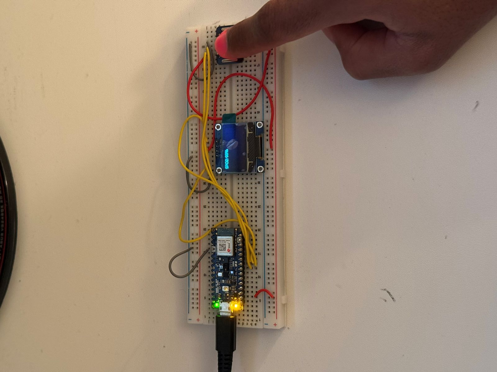
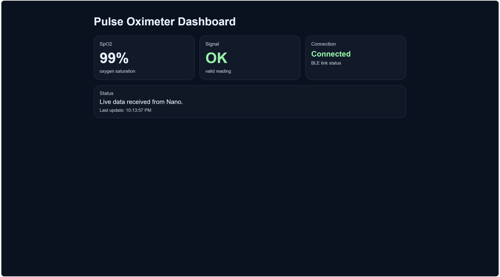
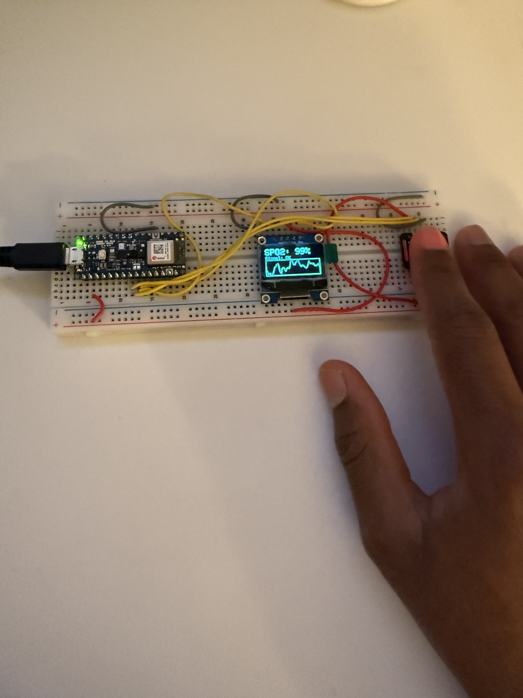
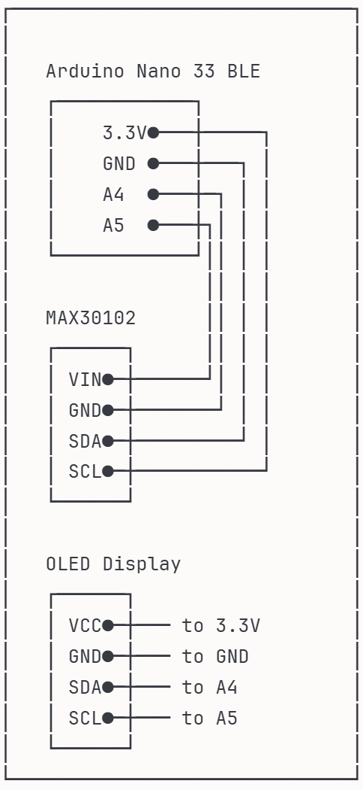

# Pulse Oximeter - MAX30102 Wireless SpO₂ Monitoring System

A real-time blood oxygen saturation (SpO₂) monitoring system using the MAX30102 sensor and Arduino Nano 33 BLE Sense Rev2 featuring OLED waveform visualization, Bluetooth Low Energy (BLE) telemetry, and a browser-based monitoring dashboard.



---

## Overview

This project implements a functional pulse oximeter using optical photoplethysmography (PPG) to estimate blood oxygen saturation levels. The system evolved from a basic embedded SpO₂ monitor into a modular biomedical sensing and wireless telemetry platform capable of:

- Real-time SpO₂ estimation
- Live OLED waveform visualization
- Bluetooth Low Energy telemetry
- Browser-based monitoring dashboard
- Real-time physiological signal visualization

The project combines embedded systems engineering, biomedical sensing, real-time rendering, and wireless telemetry into a unified pulse oximeter platform.

> **Educational Project Only**  
> This project is intended for educational and prototyping purposes only and is **not** intended for medical diagnosis or clinical use.

---

# Current Features

## Embedded Monitoring
- Real-time SpO₂ measurement
- Sliding-window signal acquisition
- Signal validity checking
- OLED physiological waveform visualization
- Real-time waveform rendering
- Continuous live graph updates

## Wireless Telemetry
- Bluetooth Low Energy (BLE) transmission
- Wireless SpO₂ broadcasting
- BLE telemetry characteristics
- Browser-accessible monitoring interface

## Browser Dashboard
- Flask-based dashboard interface
- Real-time browser telemetry
- BLE bridge using Python + Bleak
- Live connection and signal status

---

# Live Dashboard



The Phase 5 dashboard bridge enables wireless browser-based monitoring using the following telemetry pipeline:

```text
MAX30102 Sensor
        ↓
Arduino Nano 33 BLE Sense Rev2
        ↓ BLE
Python Bridge (Bleak)
        ↓
Flask Web Dashboard
```

The dashboard currently displays:
- Live SpO₂ values
- Signal validity status
- BLE connection state
- Wireless telemetry updates

---

# OLED Waveform Visualization



The OLED display evolved from a static text-based SpO₂ display into a continuously updating waveform monitor.

Features include:
- Real-time PPG waveform rendering
- Circular waveform buffering
- Dynamic signal scaling
- Continuous graph refresh behavior
- Graphics-based OLED rendering using Adafruit_GFX

The waveform is generated using infrared (IR) sensor samples from the MAX30102.

---

# Hardware Setup

## Hardware Components

| Component | Model/Type | Purpose |
|-----------|------------|---------|
| Microcontroller | Arduino Nano 33 BLE Sense Rev2 | Main processor + BLE telemetry |
| SpO₂ Sensor | MAX30102 | Optical pulse oximeter sensor |
| Display | SSD1306 OLED 128x64 (I2C) | Real-time waveform and SpO₂ display |
| Breadboard | Standard 830-point | Prototyping |
| Jumper Wires | Male-to-male | Electrical connections |
| USB Cable | Micro-USB | Power + programming |

**Total Cost:** ~$60–70

---

# Physical Prototype


The system uses:
- MAX30102 optical sensor
- Arduino Nano 33 BLE Sense Rev2
- SSD1306 OLED display
- Shared I²C communication bus

The MAX30102 sensor emits red and infrared light into the finger and measures reflected light intensity changes associated with pulsatile blood flow.

---

# Wiring Diagram



## Connections

### MAX30102 Sensor
```text
VIN  → 3.3V
GND  → GND
SDA  → A4 (SDA)
SCL  → A5 (SCL)
```

### SSD1306 OLED Display
```text
VCC  → 3.3V
GND  → GND
SDA  → A4 (SDA)
SCL  → A5 (SCL)
```

Both peripherals communicate using the shared I²C bus.

---

# Software Architecture

## Embedded Firmware

### Libraries Used
- `Wire.h` — I²C communication
- `MAX30105.h` — MAX30102 sensor driver
- `spo2_algorithm.h` — Maxim Integrated SpO₂ algorithm
- `Adafruit_GFX.h` — OLED graphics rendering
- `Adafruit_SSD1306.h` — OLED display driver
- `ArduinoBLE.h` — BLE telemetry

### Firmware Features
- Sliding-window acquisition buffer
- Continuous sample acquisition
- Real-time OLED rendering
- BLE peripheral advertising
- Modularized firmware structure
- Signal validity checking

---

# Signal Processing Pipeline

```text
Finger / Tissue
        ↓
MAX30102 Sensor
        ↓
Sample Acquisition
        ↓
Buffering + Signal Visualization
        ↓
SpO₂ Computation
        ↓
OLED Rendering + BLE Telemetry
        ↓
Browser Dashboard
```

The project uses Maxim Integrated's proprietary SpO₂ estimation algorithm.

My implementation focuses on:
- hardware integration
- embedded firmware
- real-time acquisition
- waveform visualization
- BLE telemetry
- browser dashboard integration

---

# Dashboard Bridge (Phase 5)

The browser dashboard is implemented using:

- Python
- Flask
- Bleak
- ArduinoBLE

The bridge application:
1. Scans for the Nano BLE peripheral
2. Connects using BLE
3. Reads telemetry characteristics
4. Serves live values to the browser dashboard

## Running the Dashboard

### 1. Upload Arduino Firmware

Upload the `pulse_oximeter.ino` firmware to the Arduino Nano 33 BLE Sense Rev2 using Arduino IDE.

Required Arduino libraries:
- ArduinoBLE
- Adafruit_GFX
- Adafruit_SSD1306
- SparkFun MAX3010x library

Ensure the Nano is powered and running before starting the dashboard bridge.

---

### 2. Install Python Dependencies

Install the required Python packages:

```bash
pip install flask bleak
```

---

### 3. Start the Dashboard Bridge

Navigate to the `pulse_ox_dashboard` directory and run:

```bash
python pulse_ox_bridge.py
```

The bridge will:
1. Scan for the Nano BLE device
2. Connect using Bluetooth Low Energy
3. Read telemetry characteristics
4. Serve the browser dashboard locally

---

### 4. Open the Dashboard

Open the following address in a web browser:

```text
http://127.0.0.1:5000
```

The dashboard should display:
- Live SpO₂ values
- Signal validity status
- BLE connection state
- Wireless telemetry updates

---

### 5. System Architecture

```text
MAX30102 Sensor
        ↓
Arduino Nano 33 BLE Sense Rev2
        ↓ BLE
Python Bridge (Bleak)
        ↓
Flask Web Dashboard
```

---

# Development Phases

The project evolved iteratively through several phases:

1. Baseline SpO₂ monitor
2. Real-time waveform visualization
3. Firmware modularization
4. BLE telemetry integration
5. Browser dashboard bridge
6. Planned ESP32 standalone dashboard

See full development history here:

- [Project Phases](docs/project_phases.md)
- [PPG Signal Components](docs/ppg_signal_components.md)
- [System Architecture](docs/system_architecture.md)

---

# Optimization Decisions

## LED Brightness Calibration

Empirical testing showed:

| Brightness | Result |
|------------|--------|
| 60 | Near saturation |
| 55 | Optimal stability |
| 40 | Weak signal |

Final selected brightness:

```text
55
```

This provided the best signal consistency across different users and skin tones.

---

# Known Limitations

- Motion artifacts can distort readings
- Finger placement significantly affects signal quality
- Breadboard prototype is mechanically fragile
- Heart rate estimation was intentionally deprioritized due to reliability limitations
- Dashboard currently requires a laptop bridge

---

# Future Work

## Planned ESP32 Migration

Future versions of the project will migrate the system to ESP32 hardware to eliminate the laptop bridge and host the dashboard directly over Wi‑Fi.

Planned features include:
- Native Wi‑Fi dashboard hosting
- Real-time browser waveform streaming
- Mobile-friendly UI
- Battery-powered operation
- Historical data logging
- WebSocket telemetry

---

# What I Learned

## Technical Skills
- Embedded systems programming
- I²C communication
- Biomedical sensing concepts
- PPG waveform behavior
- Real-time graphics rendering
- Bluetooth Low Energy telemetry
- Browser dashboard integration
- Firmware modularization

## Engineering Process
- Hardware/software co-design
- Incremental iterative development
- System debugging and optimization
- Trade-off analysis
- Signal validation strategies
- Wireless telemetry integration

---

# Repository Structure

```text
src/
└── pulse_oximeter/
    └── pulse_oximeter.ino

images/
├── device_demo.jpg
├── oled_waveform.jpg
├── dashboard_screenshot.png
├── wiring_diagram.png

pulse_ox_dashboard/
├── pulse_ox_bridge.py

docs/
├── ppg_signal_components.md
├── system_architecture.md
├── project_phases.md
```

---

# References

- MAX30102 Datasheet
- Maxim Integrated Pulse Oximeter Application Notes
- ArduinoBLE Documentation
- Bleak Documentation
- Flask Documentation
- Photoplethysmography (PPG) literature

---

# License

This project is licensed under the MIT License.

See:

- [LICENSE](LICENSE)

---

# Author

**Evan Torrence**

- Electrical and Computer Engineering '29 — University of Southern California
- GitHub: https://github.com/etorrence
- LinkedIn: https://www.linkedin.com/in/evantorrence/

---

**Status:** Functional prototype with BLE telemetry and browser dashboard  
**Last Updated:** May 2026

